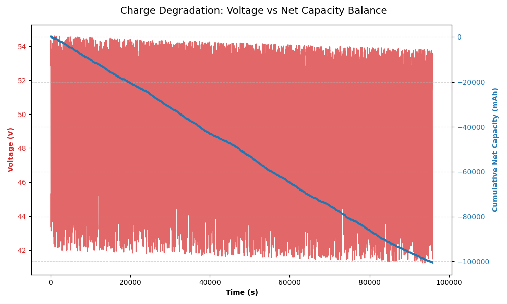

# Dynamic Battery Profiling: Capacity Integration & Data Quality Pipeline

## Overview
This project demonstrates an automated data engineering pipeline designed to process, clean, and analyze messy, real-world battery cycling data. It extracts the raw current and voltage profiles from laboratory equipment and calculates the cumulative net capacity balance over time.

## The Engineering Problem
Raw data from battery cyclers often contains corrupted headers, missing values, and high-frequency noise, especially during dynamic load profiles. Furthermore, calculating capacity using simple rectangular integration (Riemann sum) on highly dynamic current pulses leads to significant cumulative errors.

## Methodology & Business Logic
To ensure high accuracy and auditable results:
1. **Data Quality Enforcement:** Implementation of a strict data contract to coerce data types and eliminate equipment logging errors.
2. **Trapezoidal Integration:** Instead of standard Riemann sums, this pipeline applies the Trapezoidal Rule to calculate the moving average of the current between sampling points, significantly improving the accuracy of the capacity calculation ($mAh$):
   
   $$dCap = \left( \frac{I_{t} + I_{t-1}}{2} \right) \times \frac{\Delta t}{3600} \times 1000$$

## Results: Energy Depletion Analysis
The output below proves that the battery is subjected to a dynamic profile where the discharge rate exceeds the charge regeneration, leading to a net negative capacity balance over 30 cycles.

*Figure 1: Charge Degradation - Voltage vs Net Capacity Balance.*

## How to Run
1. Clone the repository.
2. Install dependencies: `pip install -r requirements.txt`
3. Run the pipeline: `python src/pipeline.py`
